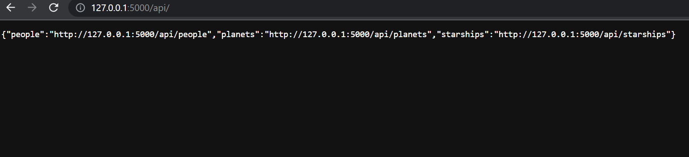

# Fake Web Server

A world clock application built to demonstrate logging in Flask.

**Tutorial**: [How to Start Fake Web Server with Flask](#).



## 🟢 Prerequisites

You must have the latest version of [Python 3](https://www.python.org) installed on your machine. This project is tested against Python 3.10.0.

## 📦 Getting started

- Clone this repo to your machine:

  ```bash
  git clone https://github.com/Jelena82/FakeServer.git
  ```

- `cd` into the project directory:

  ```bash
  cd fake-web-server
  ```

- Install Python virtual environment:

  ```bash
  python3 -m venv env
  ```

- Activate the virtual environment.

  On Windows, run:

  ```bash
  env\Scripts\activate
  ```

  On Unix or macOS, run:

  ```bash
  source env/bin/activate
  ```

- Install the requirements:

  ```bash
  python -m pip install -r requirements.txt
  ```

- Start the dev server:

  ```bash
  flask run
  ```

You should see the following output if the dev server is started successfully:

```text
 * Debug mode: off
WARNING: This is a development server. Do not use it in a production deployment. Use a production WSGI server instead.
 * Running on http://127.0.0.1:5000
Press CTRL+C to quit
```

Open your browser and go to [http://127.0.0.1:5000](http://127.0.0.1:5000)

Robot Framework provides a built-in keyword called Log To Console that can be used to print log messages 
to the console output. However, if you want to save the log messages to a file, you can use the --log option when running your test suite.

robot --log logfile.xml test_server.robot

* Useful Info
Python command to create localhost 
# python -m http.server
